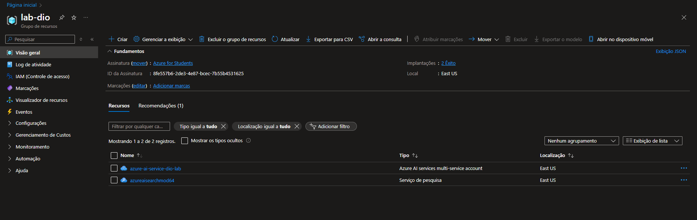
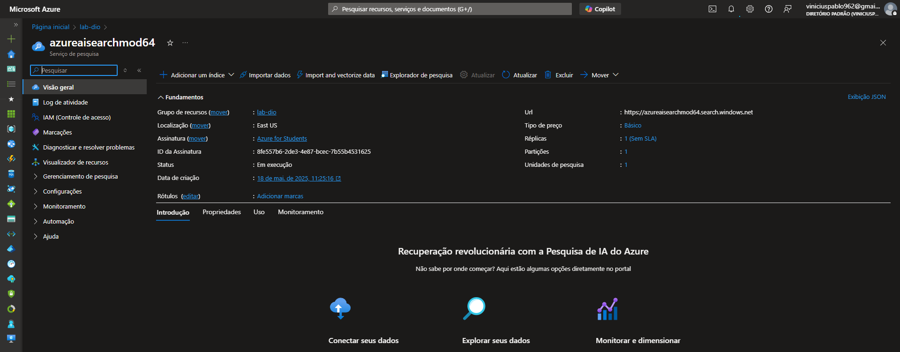
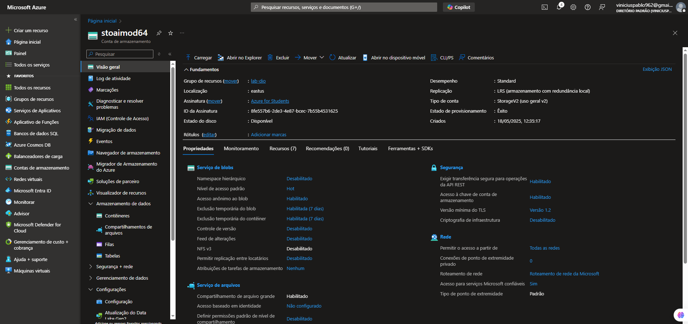
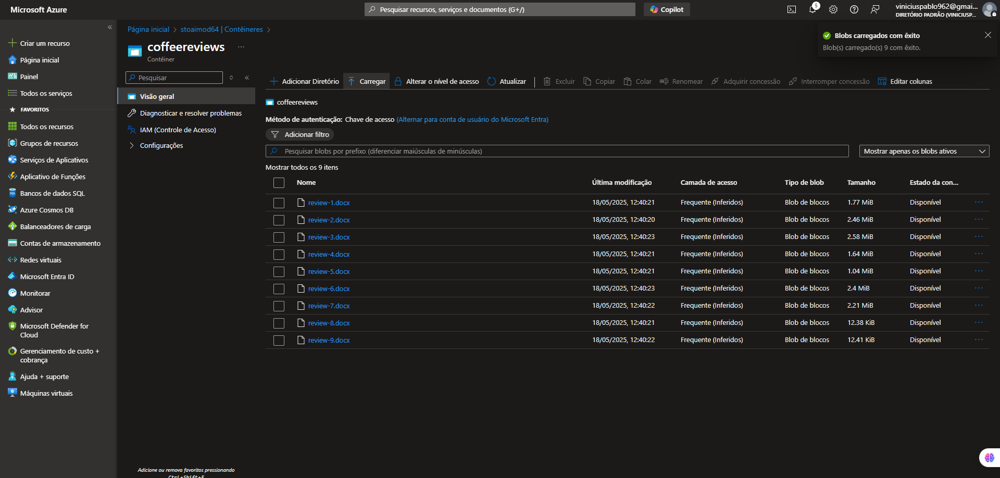
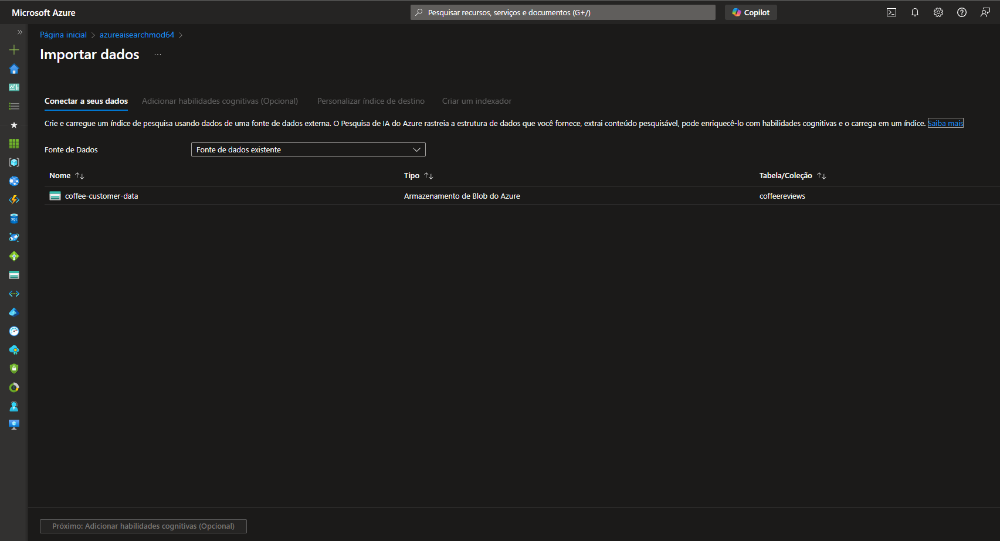
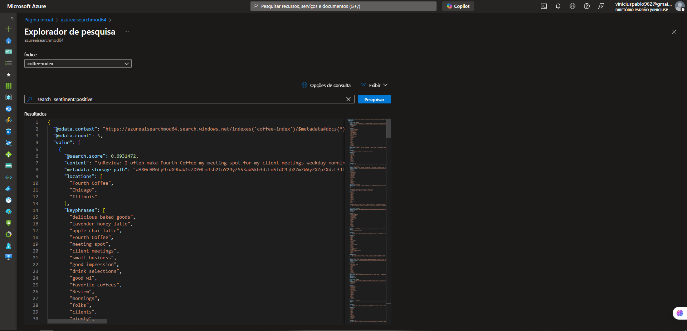
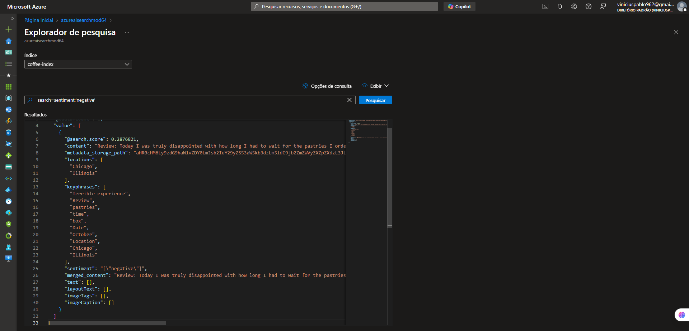

# Azure Cognitive Search: Utilizando AI Search para indexação e consulta de Dados

O Azure Cognitive Search é uma plataforma de mineração de conhecimento alimentada por IA do Azure.

## Mineração de conhecimento
- É o processo de extrair informações úteis, estruturadas ou insights a partir de grandes volumes de dados não estruturados ou semiestruturados, como:
  - Documentos
  - PDFs
  - Imagens
  - Vídeos
  - Páginas web
- Ela envolve técnicas de inteligência artificial, processamento de linguagem natural (PLN), machine learning e busca semântica, com o objetivo de transformar dados brutos em conhecimento acessível e utilizável.

## Soluções de Pesquisa Cognitiva do Azure

- Ingestão de dados
  - Azure Blob Storage containers
  - Azure Data Lake Storage Gen2
  - Azure Table Storage

## Enriquecimento e índice de IA
### Vantagens
- Permite uma compreensão mais profunda
- Visão, Processamento de Linguagem Natural, etc.
- A indexação torna o conteúdo pesquisável

### Criação
- Reconhecendo entidades no texto
- Traduzindo texto
- Avaliando o sentimento

## Passo a Passo
1. Criar um grupo de recurso (caso ainda não tenha criado): 

2. Criar um serviço de pesquisa: 

3. Criar uma conta de armazenamento: 

4. Dentro da conta de armazenamento, criar um contêiner e carregar os dados que serão utilizados: 

5. Vincular os dados carregados ao serviço de pesquisa: 

6. Finalmente, podemos realizar inúmeros tipos de pesquisa nos dados carregados, como nos exemplos a seguir: 

